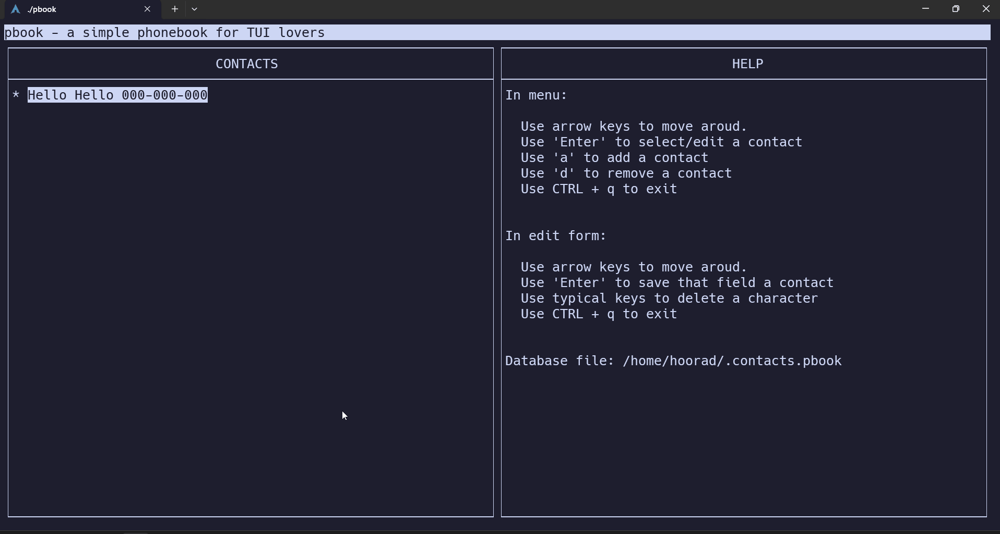

<h1 align="center">
  <br>
  
  <br>
  pbook
  <br>
</h1>
<h4 align="center">A phonebook for TUI lovers! </h4>

<p>
pbook is a simple, easy to use phonebook manager,
that stores it's database in a simple csv like file.
</p>

### Preview🙉:


### How to install⬇️:
1. Clone this repo.
```shell
git clone https://github.com/proh14/pbook.git
cd pbook
```
2. Run `make` inside this repo's main directory.
```shell
make
```

3. go to build directory
```shell
cd build
```
4. run pbook!
```shell
./pbook
```

OR to install you may run the command
```shell
make install
```
then restart your shell and run
```shell
pbook
``` 
to start the program

### Features⌨️:
1. Add's and Remove's contacts to it's database.
2. Edit's an existing contact.
3. Can store: name,number,email,birthday,Addres1,Addres2

### Work in progress⚒️:
I am spending my free time trying to optimize, fix bugs, add new features to this program.<br>
you can see the [TODO](./TODO.md) file for a list of things I want to do.

### Thank you Stargazers⭐:
[](https://github.com/proh14/ptext/stargazers)

### Thank you Forkers🍴:
[](https://github.com/proh14/pbook/network/members)

### A huge thanks to🙏:
1. [Ncurses programming HOWTO](https://tldp.org/HOWTO/NCURSES-Programming-HOWTO/)
2. [Ncurses manpages](https://linux.die.net/man/3/ncurses)
